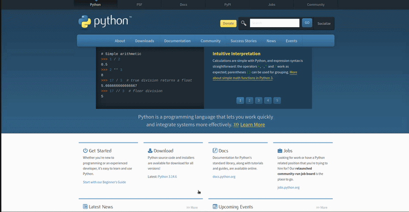

# Preparando o ambiente para o Python

## Baixando Python
Para poder utilizar o Python precisamos preparar um ambiente. O ambiente é praticamente oque você precisa para poder utilizar o python em sua máquina, é realmente bem simples, apenas precisamos baixar o python mais recente em sua máquina e baixar uma IDEs (Ambiente de Desenvolvimento Integrado), básicamente um editor de código.

Para baixar o Python é bem simples. Para baixar o Python precisamos acessar o site oficial [Python.org](https://www.python.org/), dentro do site acessamos a aba "Downloads" que aparece logo ao entrar no site, nessa aba escolhemos o sistema operacional da sua máquina e logo em seguida baixamos a versão mais atual e condizentes aos bits de sua máquina.

Exemplo: 

## IDEs (Editor de código)

O editor de código depende muito do usuário. Apesar de ser uma escolha individual, podemos observar alguns aspectos que ajudam na escolha de uma IDE confortavél para você, sempre é bom verificar a facilidade de uso, ir testando e baixando ajuda muito a se encontrar, principalmente quando está aprendendo sua primeira linguagem, além disso verifique também o desempenho os recursos disponiveis e a integração com as ferramentas. Dito isso, pesquise uma IDE boa e teste para melhorar seu aprendizado.